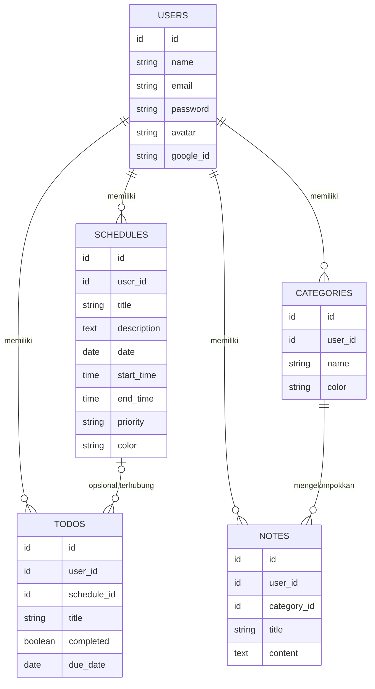

<div align="center">


# CrePlann

**Rencanakan pekanmu. Wujudkan targetmu.**

Weekly planner, todo, dan notes app — dibangun di atas Laravel, dirancang untuk terasa personal.

[](https://laravel.com)
[](https://tailwindcss.com)
[](https://laravel.com/docs/starter-kits)
[](#-lisensi)

</div>

---

## ✦ Kenapa CrePlann?

Kebanyakan planner app terasa seperti spreadsheet yang dipaksa jadi cantik. **CrePlann** dibangun dari arah sebaliknya: mulai dari bagaimana orang benar-benar merencanakan pekan mereka — jadwal, tugas, dan catatan yang saling terhubung, bukan tiga fitur terpisah yang kebetulan ada di satu aplikasi.

Setiap pengguna punya ruang privatnya sendiri: jadwal, todo, kategori, dan catatan yang terisolasi penuh per akun, siap dikembangkan dari proyek personal jadi produk multi-pengguna sungguhan.

<div align="center">

</div>

## 📖 Daftar Isi

- [Fitur Utama](#-fitur-utama)
- [Teknologi](#-teknologi)
- [Arsitektur Data](#-arsitektur-data)
- [API Endpoint](#-api-endpoint)
- [Instalasi](#-instalasi)
- [Roadmap](#-roadmap)
- [Kontribusi](#-kontribusi)
- [Lisensi](#-lisensi)

## 🎯 Fitur Utama

| | |
|---|---|
| 🗓️ **Jadwal Mingguan** | Susun `schedules` dengan prioritas dan kode warna sendiri, per hari, per jam. |
| ✅ **Todo Terhubung** | `todos` bisa berdiri sendiri atau terikat langsung ke sebuah jadwal. |
| 🗂️ **Catatan Terorganisir** | `notes` dikelompokkan lewat `categories` buatan pengguna sendiri. |
| 📊 **Ringkasan Aktivitas** | Dashboard menampilkan gambaran pekan secara sekilas, tanpa perlu buka satu-satu. |
| 🔒 **Privat per Akun** | Semua data terisolasi penuh per user — tidak ada kebocoran antar akun. |
| 🔑 **Autentikasi Siap Pakai** | Login, register, dan manajemen sesi lewat Laravel Breeze. |

## 🛠️ Teknologi

<div align="center">


</div>

| Layer | Pilihan |
|---|---|
| Backend | Laravel 12 / 13 |
| Frontend | Blade + Tailwind CSS |
| Database | MySQL (default) atau SQLite |
| Autentikasi | Laravel Breeze |

## 🧬 Arsitektur Data

Lima tabel inti, saling terhubung lewat kepemilikan `user` sebagai pusatnya:



**Ringkasan relasi:**
- `User` → hasMany `schedules`, `todos`, `categories`, `notes`
- `Category` → hasMany `notes`
- `Schedule` → hasMany `todos` *(opsional)*
- `Todo` → belongsTo `user` dan `schedule`
- `Note` → belongsTo `user` dan `category`

## 🚀 API Endpoint

Endpoint CRUD user yang sudah tersedia:

| Method | Endpoint | Keterangan |
|---|---|---|
| `GET` | `/api/users` | Daftar semua user |
| `GET` | `/api/users/{id}` | Ambil satu user berdasarkan ID |
| `POST` | `/api/users` | Buat user baru |
| `PUT` | `/api/users/{id}` | Perbarui user |
| `DELETE` | `/api/users/{id}` | Hapus user |

<details>
<summary><strong>Contoh request — <code>POST /api/users</code></strong></summary>

```json
{
  "name": "Admin",
  "email": "admin@example.com",
  "password": "password123"
}
```

</details>

## ⚙️ Instalasi

```bash
# 1. Salin file environment
cp .env.example .env

# 2. Install dependensi
composer install
npm install

# 3. Generate application key
php artisan key:generate

# 4. Jalankan migrasi database
php artisan migrate

# 5. Jalankan server lokal
php artisan serve
```

Aplikasi akan berjalan di `http://127.0.0.1:8000`.

> **Catatan:** pastikan `SESSION_DRIVER` di `.env` sesuai kebutuhanmu (`database` atau `file`). Ingin login via Google? Tinggal integrasikan [Laravel Socialite](https://laravel.com/docs/socialite) — kolom `google_id` dan `avatar` di tabel `users` sudah disiapkan untuk itu.

## 🗺️ Roadmap

- [ ] Login sosial (Google) lewat Laravel Socialite
- [ ] Notifikasi pengingat jadwal & tenggat todo
- [ ] Tampilan kalender bulanan, bukan hanya mingguan
- [ ] Ekspor jadwal ke `.ics` / Google Calendar
- [ ] Mode kolaborasi — berbagi jadwal ke pengguna lain

## 🤝 Kontribusi

Proyek ini masih terus berkembang. Ide, laporan bug, atau pull request sangat terbuka — silakan buat *issue* baru atau ajukan PR.

Dokumen perencanaan sumber tersedia di folder `required/`:
- `required/A-ProjectSpec.md`
- `required/B-Concept.md`

## 📄 Lisensi

Dirilis di bawah lisensi **MIT** — bebas digunakan, dimodifikasi, dan dikembangkan lebih lanjut.

---

<div align="center">
<br/>
<em>CrePlann — rencana mingguan yang lebih mudah dan lebih visual.</em>
</div>